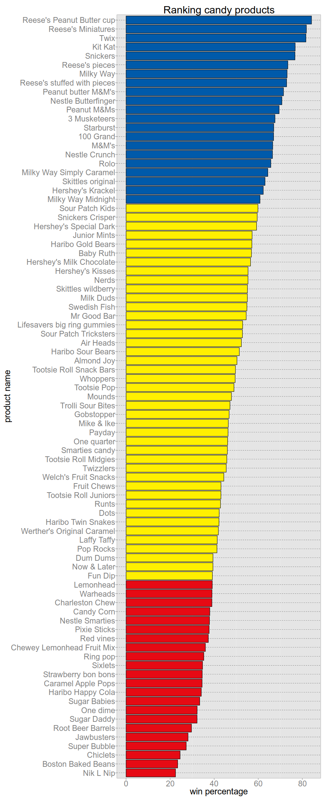
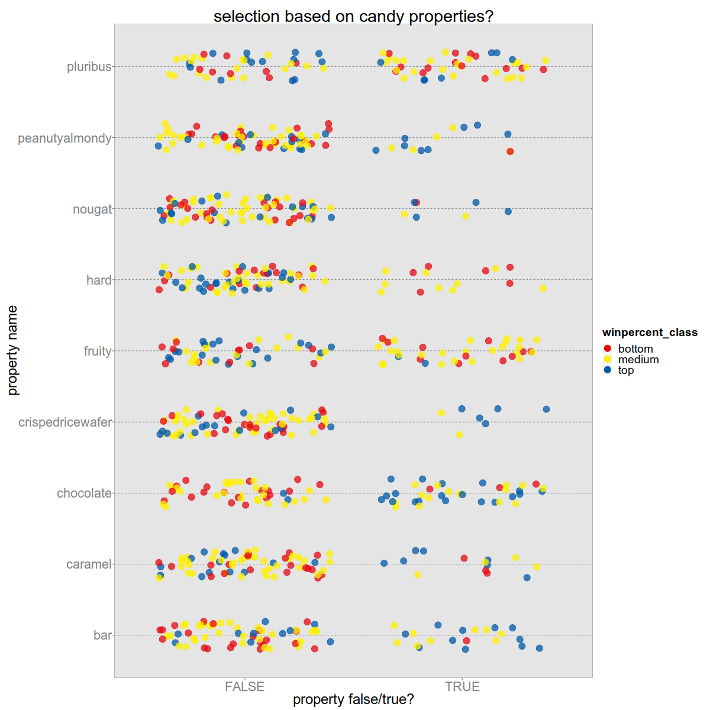

# VSG, Case Study

Die Beliebtheit von Süsswaren soll ermittelt werden. Es stehen dazu
Beispieldaten von
[candy-power-ranking](https://github.com/fivethirtyeight/data/tree/master/candy-power-ranking)
zur Verfügung.

# Vorgehensweise

Der Datensatz wird eingelesen und exploriert, dann werden verschiedene Dinge ausprobiert.

## Deskriptiv 

Um nicht gleich auf die vollen Details gehen zu müssen, teile ich die Produkte
in drei Gruppen ein: top/medium/bottom (25/50/25%). 

- Mir sind nicht alle Produkte bekannt :-)
- Unter den beliebtesten scheinen auch einige der bekanntesten zu sein: Twix,
	Kit Kat, Milky Way, Snickers, M&Ms. Gehört eh alles zu Mars, das sollte der
	Einkauf dann bedenken.
- Ausser den Eigenschaften der Produkte (siehe nächster Abschnitt) gibt es noch
	ein Ranking im Zuckergehalt und im Preisvergleich, jeweils nur relativ zu den
	anderen betrachteten Produkten.
- Keine echten Preise, keine echten Umsätze, keine Margen; d.h. das wird eine
	recht einseitige idealistische Betrachtung der Beliebtheit, die die
	Randbedingungen eines Supermarkts total vernachlässigt.

## Clustering / graphischer Drilldown

Bevor ich zur Regression komme, kam erst die Idee mit der Gruppenbildung. Gibt
es, basierend auf den Produkteigenschaften, ähnliche Produkte, die dann auch
ähnlich beliebt sind?

Clustering mit binären Variablen (*chocolate ja/nein*) ist etwas schwierig, aber vielleicht reicht 
hier schon ein einfacher grafischer Ansatz als Drilldown.

Die Daten werden wieder so in Gruppen aufgeteilt wie vorher. Jedes Süssigkeitenmerkmal wird mit TRUE/FALSE dargestellt.

Was wird gesucht? Gruppen mit möglichst vielen blauen Produkten oder mit
möglichst vielen roten Punkten, d.h. mit Eigenschaften, die auf beliebte
Produkte zutreffen und welchen, die auf unbeliebte Produkte zutreffen.

 

## Regression

## Weitere Ideen
